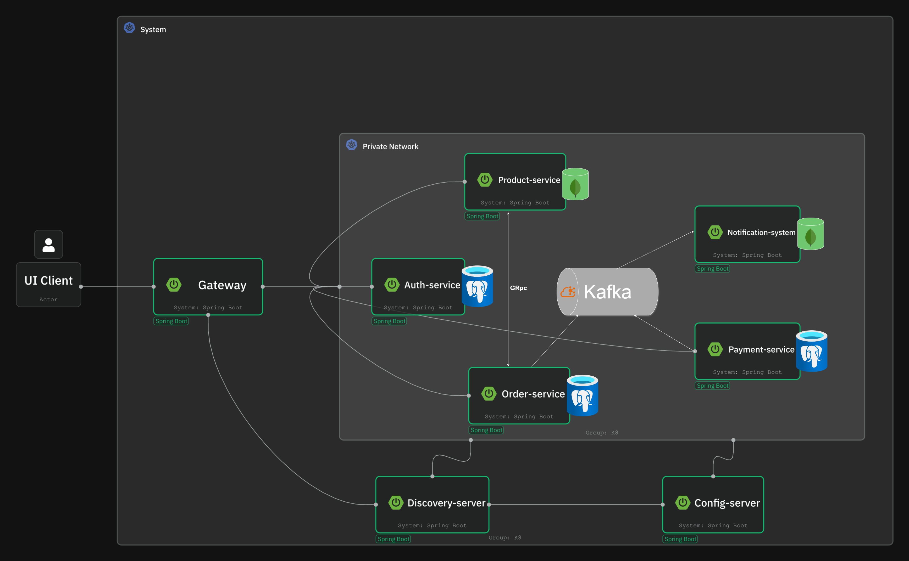

# E-Mercurius Microservices App

This project is a **deep microservices architecture training app** for building an e-commerce platform using modern tools and best practices.

---

## 🚀 Project Overview



This system consists of multiple Spring Boot microservices, each encapsulating a business capability:

- API Gateway (Spring Cloud Gateway)
- Config Server (Spring Cloud Config)
- Discovery Server (Eureka)
- Auth Service (User authentication and authorization)
- Product Service (Product catalog and search)
- Order Service (Order processing)
- Payment Service (Payment handling)
- Notification Service (Email/SMS notifications)

### Key Technologies

- **Spring Boot / Spring Cloud**
- **Kafka** for event-driven communication
- **gRPC** for inter-service synchronous calls
- **PostgreSQL**, **MongoDB**, **Redis**
- **Elasticsearch** for product search
- **Docker & Kubernetes** for containerization and orchestration
- **OpenTelemetry + Jaeger + Grafana** for observability
- **JUnit, Mockito, JMeter** for testing

---

## 📁 Project Structure

```
ecommerce-app/
├── common-libs/
├── microservices/
│   ├── api-gateway/
│   ├── config-server/
│   ├── discovery-server/
│   ├── auth-service/
│   ├── product-service/
│   ├── order-service/
│   ├── payment-service/
│   └── notification-service/
```

Each service is a standalone Spring Boot app with its own database and responsibilities.

---

## 🛠️ Setup & Running Locally

### Prerequisites

- Java 21
- Docker & Docker Compose
- IntelliJ IDEA (recommended)
- Kubernetes (Minikube or kind) — optional for local k8s

### Steps

1. **Clone the repo**

   ```bash
   git clone https://github.com/yourusername/ecommerce-app.git
   cd ecommerce-app
   ```

2. **Start Infrastructure Services**

   Run Kafka, PostgreSQL, MongoDB, Redis, Elasticsearch locally:

   ```bash
   docker-compose up -d
   ```

3. **Run Config Server**

   Run the Config Server first, which provides centralized config to all services.

4. **Run Discovery Server**

   Start the Eureka discovery service.

5. **Run Microservices**

   In IntelliJ, run each service module (auth-service, product-service, order-service, etc.).

6. **Access API Gateway**

   The gateway routes requests to internal services.

---

## ⚙️ Technologies and Frameworks

| Component         | Technology                     |
|-------------------|--------------------------------|
| API Gateway       | Spring Cloud Gateway           |
| Config Server     | Spring Cloud Config            |
| Service Discovery | Eureka                         |
| Messaging         | Apache Kafka                   |
| RPC               | gRPC (HTTP/2)                  |
| Databases         | PostgreSQL, MongoDB, Redis     |
| Search            | Elasticsearch                  |
| Containerization  | Docker, Kubernetes             |
| Observability     | OpenTelemetry, Jaeger, Grafana |
| Testing           | JUnit, Mockito, JMeter         |

---

## 📚 Development Guidelines

- Each microservice has its own `build.gradle` and runs independently.
- Use `common-libs` for shared DTOs and utilities.
- Use Kafka for asynchronous communication, gRPC for synchronous calls.
- Centralized config using Spring Cloud Config.
- Use Eureka for service discovery during local development.
- Observability is enabled with OpenTelemetry traces, logs, and metrics.
- Docker Compose for local infra, Helm/K8s manifests for cloud deployment.

---

## 🧪 Testing

- Unit tests with JUnit and Mockito.
- Integration tests using Testcontainers.
- Load and performance tests with JMeter.
- Tracing and logging to analyze system behavior.

---

## 📈 Monitoring & Logging

- Grafana dashboards monitor key metrics.
- Jaeger UI for distributed tracing.
- Logs are collected centrally using OpenTelemetry.

---

## 📖 Further Reading & References

- [Spring Cloud Documentation](https://spring.io/projects/spring-cloud)
- [Apache Kafka](https://kafka.apache.org/)
- [gRPC Official Site](https://grpc.io/)
- [OpenTelemetry](https://opentelemetry.io/)
- [Kubernetes Basics](https://kubernetes.io/docs/tutorials/kubernetes-basics/)

---

## 🔧 Contributing

Feel free to open issues and submit pull requests.  
Please follow the code style and write tests for new features.

---

*Happy coding and microservice mastering!* 🚀
